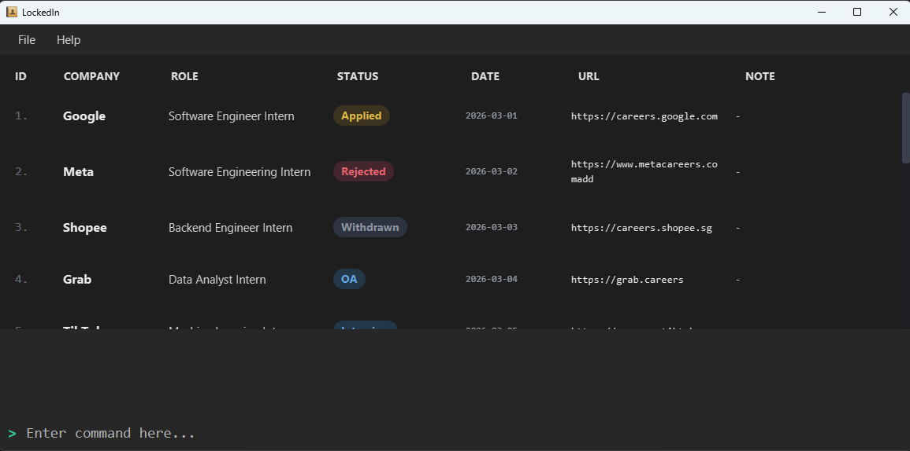

# LockedIn User Guide

LockedIn is a desktop app for **Computer Science undergraduates applying for internships**. It helps you keep track of applications, roles, links, and statuses in one place.

LockedIn is optimized for users who prefer typing commands. If you are comfortable with keyboard-driven workflows, LockedIn helps you update and check your applications faster while reducing context switching between job portals, spreadsheets, and email threads.

<!-- * Table of Contents -->
<page-nav-print />

--------------------------------------------------------------------------------------------------------------------

## About LockedIn

### --Who LockedIn is for

LockedIn is designed for Computer Science undergraduates who

- apply to many internships at once
- want to track applications across different companies and portals
- prefer fast keyboard-based input
- want one place to record important application details

 

### --What LockedIn helps you do

LockedIn helps you

- record internship applications
- store company names and role titles
- save application links for quick access
- track the current stage of each application
- search for applications by company, role, application date, or status
- update entries quickly as applications progress

 

### --What LockedIn does not do

LockedIn does **not**

- submit job applications for you
- sync directly with job portals or email inboxes
- automatically detect application updates
- generate analytics or summaries of your applications

It is a fast CLI-based logbook for managing internship applications.

 

--------------------------------------------------------------------------------------------------------------------

## Quick start

Follow these steps to get LockedIn running.

### 1. Install Java

Ensure that Java `17` or above is installed on your computer.

**Mac users:** Ensure that you use the precise JDK version prescribed [here](https://se-education.org/guides/tutorials/javaInstallationMac.html).

---

### 2. Download LockedIn

Download the latest `.jar` file from the [LockedIn release page](https://github.com/AY2526S2-CS2103T-W12-2/tp/releases).

---

### 3. Choose a folder for LockedIn

Copy the `.jar` file to the folder you want to use as the _home folder_ for LockedIn.

---

### 4. Open LockedIn

Open a terminal in that folder and run:

`java -jar lockedin.jar`

> If your downloaded file has a different name, replace `lockedin.jar` with the actual file name.

A GUI similar to the one below should appear in a few seconds. The app starts with sample data so that you can see how LockedIn works.

---

### 5. Enter a command

Type a command in the command box and press Enter to run it.

Here are a few commands you can try:

- `list`  
  Shows all saved applications.

- `add n/Google r/Software Engineer Intern d/2025-02-14 u/https://careers.google.com s/Applied`  
  Adds a new application.

- `delete 3`  
  Deletes the 3rd application shown in the current list.

- `clear`  
  Deletes all applications.

- `help`  
  Opens the help window.

---

### 6. Learn the command format

Before using the commands below, read [Notes about the command format](#notes-about-the-command-format).

---

### 7. Explore the commands

Refer to the [Features](#features) section below for the full list of commands.

 

--------------------------------------------------------------------------------------------------------------------

## Features

### Notes about the command format

<box type="info" seamless>

**How to read command formats**

- Words in `UPPER_CASE` are values to be supplied by the user.  
  Example: in `add n/COMPANY`, `COMPANY` can be used as `Google`.

- Items in square brackets are optional.  
  Example: `n/COMPANY [u/URL]` can be used as `n/Google u/https://careers.google.com` or as `n/Google`.

- Parameters can be entered in any order.  
  Example: if the command specifies `n/COMPANY r/ROLE`, `r/ROLE n/COMPANY` is also accepted.

- Extra words for commands that do not take parameters, such as `help`, `list`, `exit`, and `clear`, are ignored.  
  Example: `help 123` is treated as `help`.

- If you are using a PDF version of this document, be careful when copying commands that wrap across multiple lines. Spaces around line breaks may be omitted when pasted into the app.

</box>

---

### View help: `help`

Opens the help window.

**Format:** `help`

**What you should expect**
- A help window appears.

---

### Add an application: `add`

Adds a new application to LockedIn.

**Format:** `add n/COMPANY r/ROLE d/APPLICATION_DATE [u/URL] [s/STATUS]`

**Field meaning**
- `COMPANY` — company name
- `ROLE` — position title
- `APPLICATION_DATE` — the date when you applied
- `URL` — application link or portal link
- `STATUS` — current application stage

**Notes**
- `COMPANY` and `ROLE` must contain only alphanumeric characters and spaces, and must not be blank.
- `APPLICATION_DATE` must be a valid date in the format `yyyy-MM-dd`.
- `URL`, if provided, must start with `http://` or `https://`.

<box type="tip" seamless>

**Tip:**  
If you omit `s/STATUS`, LockedIn uses `Applied` as the default status.

</box>

**Examples**
- `add n/Google r/Software Engineer Intern d/2025-02-14`
- `add n/OpenAI r/Research Intern d/2025-03-01 u/https://jobs.openai.com s/Interview`
- `add n/Shopee r/Backend Intern d/2025-02-20 u/https://careers.shopee.sg`

**What you should expect**
- A success message appears.
- The new application is added to the list.

---

### List all applications: `list`

Shows all applications in LockedIn.

**Format:** `list`

**What you should expect**
- The full application list is shown again.
- This is useful after using `find` to return to the full list.

---

### Edit an application: `edit`

Edits an existing application in LockedIn.

**Format:** `edit INDEX [n/COMPANY] [r/ROLE] [d/APPLICATION_DATE] [u/URL] [s/STATUS]`

**Notes**
- `INDEX` refers to the index number shown in the displayed application list.
- `INDEX` must be a positive integer such as `1`, `2`, or `3`.
- You must provide at least one field to edit.
- Existing values are updated to the input values.
- `COMPANY` and `ROLE` must contain only alphanumeric characters and spaces, and must not be blank.
- `APPLICATION_DATE` must be a valid date in the format `yyyy-MM-dd`.
- `URL`, if provided, must start with `http://` or `https://`.

**Examples**
- `edit 1 r/Software Engineer d/2025-03-10`
- `edit 2 n/OpenAI s/Offered`
- `edit 3 u/https://careers.example.com s/OA`

**What you should expect**
- A success message appears.
- The selected application is updated.

---

### Move an application to the next stage: `next`

Moves an application to the next stage in the application workflow.

**Format:** `next INDEX`

**Notes**
- `INDEX` refers to the index number shown in the displayed list.
- `INDEX` must be a positive integer.
- LockedIn updates the selected application to the next stage in the status sequence.

**Current status sequence**  
`Applied -> OA -> Interview -> Offered -> Rejected -> Withdrawn -> Applied`

**Examples**
- `next 1`
- `list` followed by `next 3`

**What you should expect**
- The selected application's status changes to the next stage.

<box type="warning" seamless>

**Warning:**  
`next` follows a fixed sequence. If you want to set a specific status directly, use `edit INDEX s/STATUS` instead.

</box>

---

### Copy an application URL: `copy`

Copies the URL of an application to your system clipboard.

**Format:** `copy INDEX`

**Notes**
- `INDEX` refers to the index number shown in the displayed list.
- `INDEX` must be a positive integer.
- The selected application must already contain a URL.

**Examples**
- `copy 1`
- `find n/Google` followed by `copy 1`

**What you should expect**
- If the selected application has a URL, LockedIn copies it to your clipboard.
- If the selected application has no URL, LockedIn shows an error message.

---

### Find applications: `find`

Finds applications whose company names, roles, application dates, or statuses match the given keywords.

**Format:** `find [n/COMPANY_NAME] [r/ROLE] [d/APPLICATION_DATE] [s/STATUS]...`

**Notes**
- You must provide at least one parameter.
- The search is case-insensitive.  
  Example: `n/google` matches `Google`.
- The order of keywords does not matter.  
  Example: `n/Google Meta` matches both Google and Meta.
- Only full words are matched.  
  Example: `n/Goog` does **not** match `Google`.
- Applications matching at least one keyword in the same field are returned.
- If multiple fields are specified, applications must match all those fields.

**Examples**
- `find n/Google`
- `find r/Intern`
- `find n/Google r/Intern`
- `find s/Applied`
- `find n/TikTok s/Interview`

**What you should expect**
- The application list updates to show only matching entries.

<box type="tip" seamless>

**Tip:**  
After using `find`, use `list` to return to the full application list.

</box>

---

### Delete an application: `delete`

Deletes the specified application from LockedIn.

**Format:** `delete INDEX`

**Notes**
- `INDEX` refers to the index number shown in the displayed list.
- `INDEX` must be a positive integer.

**Examples**
- `delete 2`
- `find n/Google` followed by `delete 1`

**What you should expect**
- The selected application is removed from the list.

---

### Clear all applications: `clear`

Deletes all applications from LockedIn.

**Format:** `clear`

**What you should expect**
- All saved applications are removed.

<box type="warning" seamless>

**Warning:**  
This command removes every application in LockedIn. Use it carefully.

</box>

---

### Exit LockedIn: `exit`

Exits LockedIn.

**Format:** `exit`

**What you should expect**
- The app closes.

 

--------------------------------------------------------------------------------------------------------------------

## Saving and editing data

### Saving data

LockedIn data are saved automatically after any command that changes the data.

You do not need to save manually.

 

### Editing the data file

LockedIn data are saved automatically as a JSON file in the data folder of the app.

> Update the exact filename below if your project uses a different file name.

Current path shown in this draft: `[JAR file location]/data/addressbook.json`

Advanced users may update data directly by editing that file.

<box type="warning" seamless>

**Caution:**  
If your changes make the data file invalid, LockedIn may discard the data and start with an empty data file the next time it runs.

Before editing the data file:
- make a backup copy first
- keep the JSON format valid
- edit the file only if you are confident you understand the format

</box>

 

--------------------------------------------------------------------------------------------------------------------

## FAQ

**Q: What date format should I use?**  
A: Use the format `yyyy-MM-dd`. For example, `2025-02-14`.

 

**Q: What does `INDEX` mean?**  
A: `INDEX` is the number shown next to an application in the current displayed list. Use it for commands like `edit`, `delete`, `next`, and `copy`.

 

**Q: Why does my command not work?**  
A: Check the command format carefully. Common mistakes include:
- using the wrong date format (correct format: yyyy-MM-dd)
- entering an invalid index (check the relevant command section)
- forgetting a required prefix such as `n/` or `r/`
- omitting required fields

 

**Q: Why can’t I copy a URL?**  
A: The selected application may not have a URL saved. Add one first using `edit INDEX u/URL`.

 

**Q: How do I return to the full application list after using `find`?**  
A: Use the `list` command.

 

**Q: What statuses can an application have?**  
A: LockedIn currently uses these statuses: `Applied`, `OA`, `Interview`, `Offered`, `Rejected`, and `Withdrawn`.

 

**Q: How do I move my data to another computer?**  
A: Install LockedIn on the other computer and replace the empty data file it creates with the data file from your current LockedIn home folder.

 

--------------------------------------------------------------------------------------------------------------------

## Known issues
1. **When using multiple screens**, if you move the application to a secondary screen and later switch back to using only the primary screen, the GUI may open off-screen. Delete the `preferences.json` file before running the application again.

2. **If you minimize the Help window** and then run `help` again, the original Help window may remain minimized, and no new Help window may appear. Restore the minimized Help window manually.

 

--------------------------------------------------------------------------------------------------------------------

## Command summary

| Action | Format | Example |
| --- | --- | --- |
| **Add** | `add n/COMPANY r/ROLE d/APPLICATION_DATE [u/URL] [s/STATUS]` | `add n/Google r/Software Engineer Intern d/2025-02-14 u/https://careers.google.com s/Applied` |
| **Clear** | `clear` | `clear` |
| **Copy** | `copy INDEX` | `copy 3` |
| **Delete** | `delete INDEX` | `delete 3` |
| **Edit** | `edit INDEX [n/COMPANY] [r/ROLE] [d/APPLICATION_DATE] [u/URL] [s/STATUS]` | `edit 2 n/OpenAI s/Offered` |
| **Find** | `find [n/COMPANY_NAME] [r/ROLE] [d/APPLICATION_DATE] [s/STATUS]...` | `find n/Google r/Intern` |
| **Help** | `help` | `help` |
| **List** | `list` | `list` |
| **Next** | `next INDEX` | `next 3` |
| **Exit** | `exit` | `exit` |
